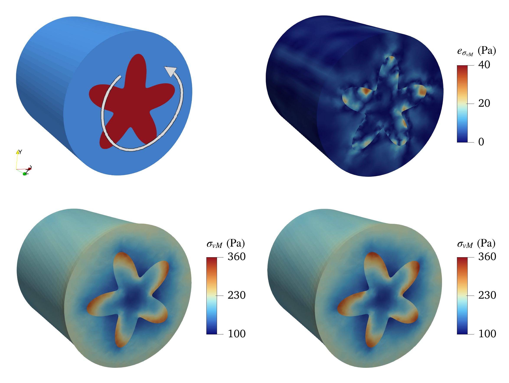

# Variational PI-GNNs for Heterogeneous Solid Mechanics

Code accompanying the paper [*A variational physics-informed graph neural network for heterogeneous solid mechanics*](https://arxiv.org/html/2609.10983v1).

This repository implements a label-free, variational physics-informed graph neural network (PI-GNN) for heterogeneous solid mechanics.  It treats a conforming finite-element mesh as a graph, assigns material behaviour element-wise, and learns the displacement field by minimising discrete total potential energy.  Essential boundary conditions are imposed by construction. It has a single scalar loss function with no interface penalty; transition width or reference-solution labels are not required for training.

The supplied examples compare PI-GNN predictions against FEniCSx finite-element reference solutions.

## Included examples

| Folder | Problem | Material model |
|---|---|---|
| [2D_hole_radius_1](2D_hole_radius_1/) | Plate with a circular void under uniaxial traction | Linear elasticity, plane stress |
| [3D_petal_inc_torsion](3D_petal_inc_torsion/) | Composite circular rod with a petal-shaped inclusion under torque | Finite-strain Neo-Hookean elasticity |

Each folder is self-contained and includes meshing, training, FEM reference, evaluation, environment requirements, and detailed instructions.  Start with its local README.



## Run an example

```bash
git clone https://github.com/aashay-y/Variational-PIGNN-composites.git
cd Variational-PIGNN-composites
cd 2D_hole_radius_1
conda env create -f environment.yml
conda activate femml
python run_pipeline.py --config hole_config.json --plate-size 20 \
    --epochs 20000 --seed 0
```

This command generates the mesh, trains the PI-GNN, and compares it with a FEniCSx FEM solution.  It writes mesh files, the best model checkpoint, figures, field data, and error summaries to the case directories.  The 3-D example has the same workflow; use its [detailed README](3D_petal_inc_torsion/README.md) for the published torsion-case command and expected errors.

For a quick inspection of the 2-D mesh without training or FEM evaluation:

```bash
python meshing_pipeline.py hole_config.json --plate-size 20 \
    --output mesh_plate_hole
```

The workflow is:

```text
adaptive mesh generation → graph construction → energy-based PI-GNN training → FEM comparison
```

## Citation

If you use this code, please cite the accompanying [arXiv paper](https://arxiv.org/abs/2609.10983):

```bibtex
@article{yadav2026variational,
  title   = {A variational physics-informed graph neural network for heterogeneous solid mechanics},
  author  = {Yadav, Aashay Rajan and Das, Amiya Prakash and Annabattula, Ratna Kumar},
  journal = {arXiv preprint arXiv:2609.10983},
  year    = {2026}
}
```

## License

Released under the [MIT License](LICENSE).
